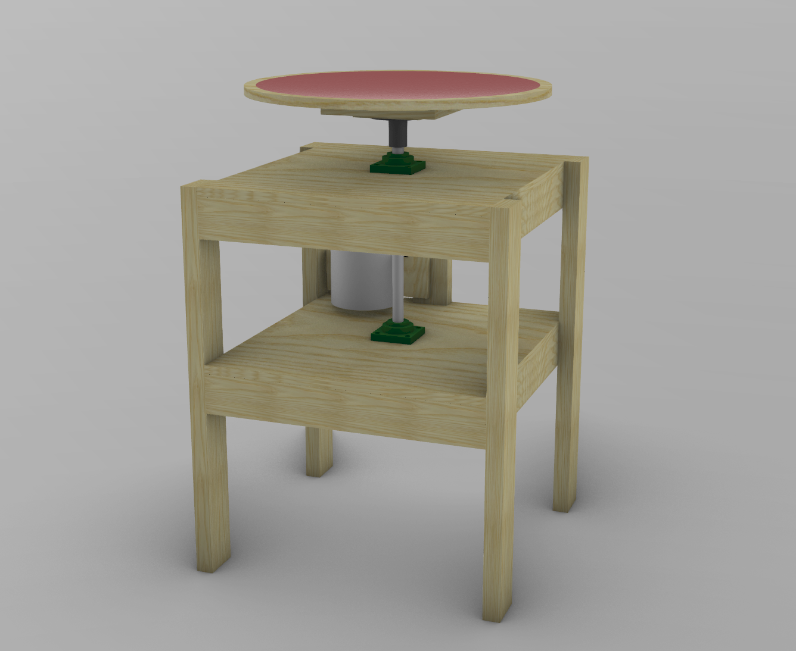

# Radius Sanding Machine

The radius sanding machine is designed to solve the tiring process of sanding a radius into your bracing, as well as the sides of the guitar.  It makes quick work of a job that typically takes a lot of time and energy.



The machine is built with standard lumber.  Mechanical parts are sourced from Amazon & Home Depot.

### Lumber
- 2x4's
- 3/4" plywood
- MDF

### Mechanical
- [1" steel shaft](https://www.amazon.com/dp/B000H9PGW6)
- [Pillow block bearings](https://www.amazon.com/dp/B07QLBYT1Y)
- [14" blower pulley](https://www.homedepot.com/p/DIAL-14-in-x-1-in-Evaporative-Cooler-Blower-Pulley-6341/205560296)
- 2" motor pulley
- [4" Go-cart axle hub](https://www.amazon.com/dp/B087JB5VKC)
- 1750 RPM Motor

### Features
- Motor speed reducing pulleys (1750 RPM -> 250 RPM)
- Removable radius dishes

### Modification/Editing Notes

- The ```.3dm``` file is a Rhino CAD master.  If you have Rhino, you can edit/modify the design source
- If you make modifications, please submit a Pull Request with the changes so we can incorporate and make your changes available to others.

### License
MIT
** You're free to use and modify, but must retain the copyright **
